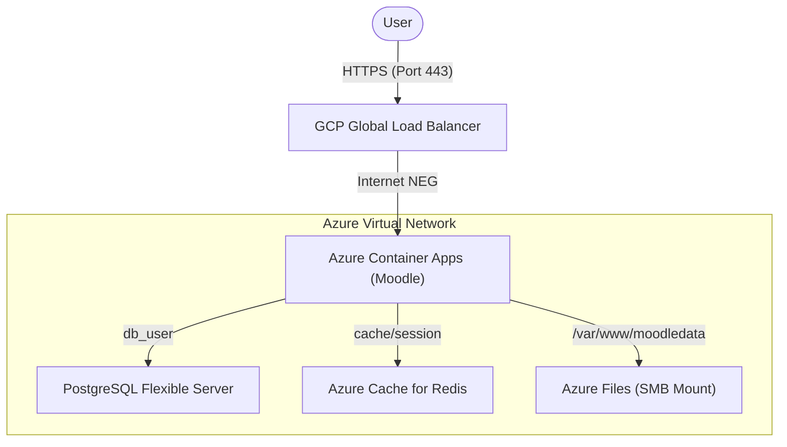

# 🎓 ESMOS Moodle: Enterprise Build for Azure Container Apps

This repository contains a performance-optimized, production-ready container image for Moodle 5.1, specifically engineered for **Azure Container Apps (ACA)** and other serverless container platforms.

## 🏗️ Key Design Principles

The ESMOS Moodle image adheres to modern cloud-native standards to ensure reliability, scalability, and security in a healthcare environment:

*   **Stateless Execution**: The container is ephemeral. All persistence—including file uploads (`moodledata`), session state, and databases—is handled by external managed services.
*   **Rapid Cold Start**: Optimized for ACA's scale-to-zero capabilities, achieving cold starts under 5 seconds by avoiding runtime repository clones or heavy configuration steps.
*   **Pre-Baked Dependencies**: All Moodle core code and required plugins are "baked" into the image during the build stage, ensuring consistency across deployments.
*   **Auto-Tuning Runtime**: The container includes an intelligent entrypoint that automatically calculates PHP-FPM and Nginx worker thresholds based on the available container memory/CPU.

---

## 📐 Architecture



### Component Breakdown

| Component | Technology | Responsibility |
| :--- | :--- | :--- |
| **Runtime** | PHP 8.3 + FPM (Alpine) | Core application logic and execution. |
| **Web Server** | Nginx | High-performance request handling and static asset serving. |
| **Persistence** | Azure Files (SMB) | Shared storage for `moodledata` across all container replicas. |
| **State** | Redis (Optional) | Centralized session and application caching for horizontal scaling. |
| **Database** | PostgreSQL | Managed database for persistent platform state. |

---

## 📂 Project Structure

```text
.
├── terraform/          # Infrastructure-as-Code for Azure App deployment
├── .github/worklows/   # CI/CD pipelines for building and deploying to ACR
├── Dockerfile          # Multi-stage production build (Builder + Runtime)
├── entrypoint.sh       # Dynamic runtime configuration and warming
├── plugins.json        # Manifest file for baking plugins into the image
├── supervisord.conf    # Process manager for Nginx and PHP-FPM
└── docker-compose.yml  # Local development environment
```

---

## 🔐 Configuration

The image is configured primarily through environment variables.

### Database Settings
| Variable | Default | Description |
| :--- | :--- | :--- |
| `DB_TYPE` | `pgsql` | Database driver (`pgsql`, `mysqli`, `sqlsrv`). |
| `DB_HOST` | `localhost` | FQDN or IP of the database server. |
| `DB_NAME` | `moodle` | Target database name. |
| `DB_USER` | `moodle` | Managed Database username. |
| `DB_PASS` | — | Database password (Sensitive). |

### Application Settings
| Variable | Default | Description |
| :--- | :--- | :--- |
| `MOODLE_URL` | — | The public-facing URL (e.g., https://moodle.example.com). |
| `REDIS_HOST` | — | Hostnames for Redis session/cache handling. |
| `PUID / PGID` | `33` | User/Group ID for file permission alignment (optional). |

---

## 🚀 Operational Guide

### 1. Local Development
To spin up a local instance including a database and Redis for testing:
```bash
docker compose up --build
```
The site will be available at `http://localhost:8080`.

### 2. First-Time Database Initialization
The image does not perform destructive schema operations automatically. For new installations, execute:
```bash
docker exec -it moodle-app php admin/cli/install_database.php \
  --adminuser=admin \
  --adminpass=CHANGE_ME_123! \
  ... [see Moodle CLI docs for full arguments]
```

### 3. Lifecycle & Upgrades
Updates to Moodle core or plugins should be handled by modifying the `Dockerfile` or `plugins.json` and triggering a new build. 
For database schema upgrades after an image update:
```bash
# Recommended to run as a one-time ACA Job
php admin/cli/upgrade.php --non-interactive
```

---

## ⚡ Performance & Optimization
*   **OpCache**: Enabled with optimized buffers for enterprise-scale workloads.
*   **APCu**: Integrated for fast local object caching.
*   **Intelligent Buffering**: Nginx buffers are dynamically optimized for high-latency storage mounts common in cloud environments.

---
*Maintained by the ESMOS Healthcare Development Team.*
